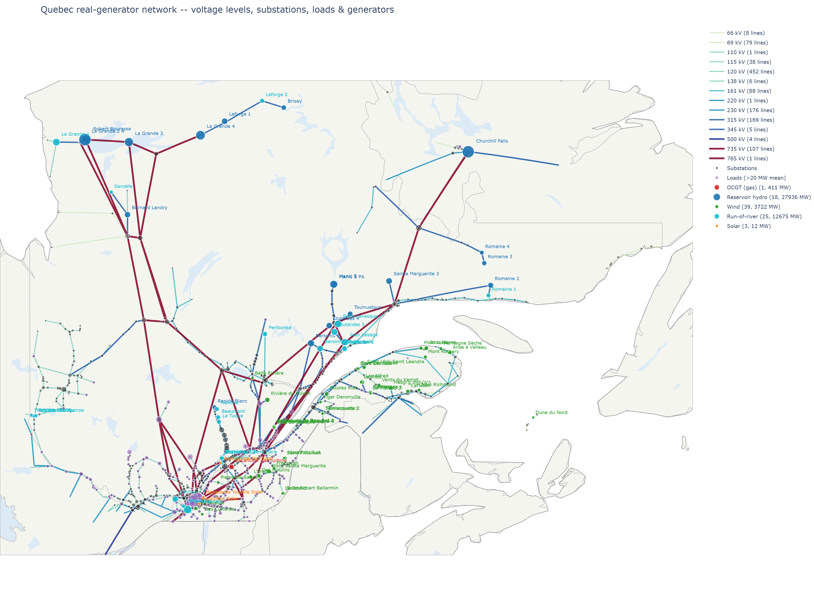
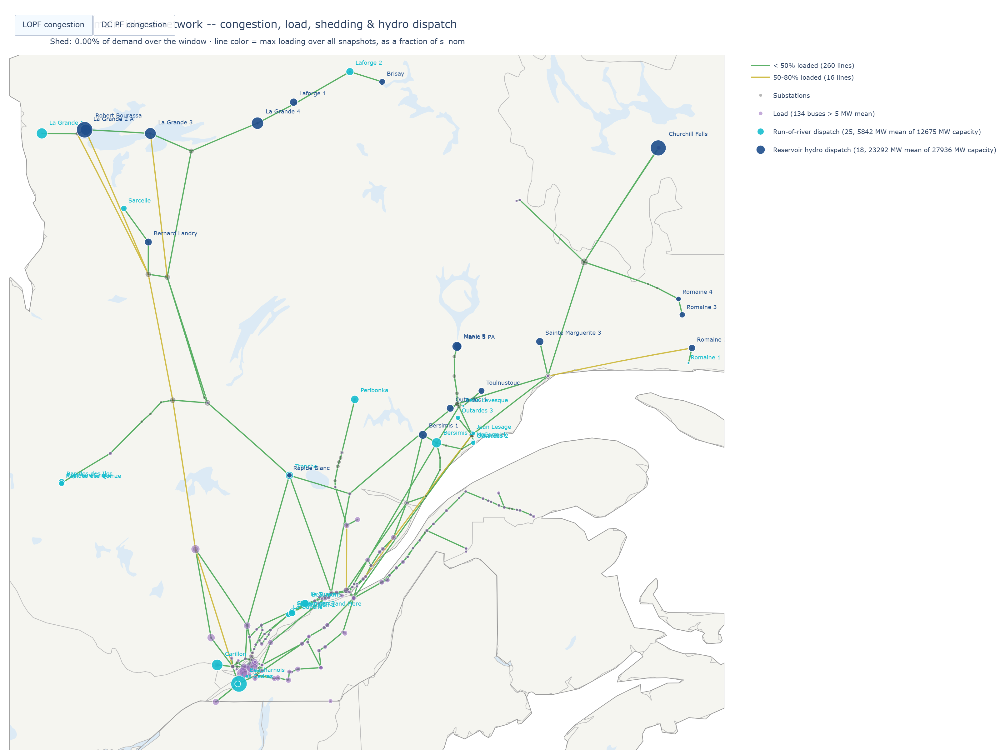

# Network versions

Four network files, each built for a different purpose -- not versions of the same thing, and not
interchangeable. The first three are distinct topologies (unreduced, 315kV, 735kV); the fourth is
a demand-scaled sensitivity test on the third, not a new topology.

## 1. Unreduced (`elec_full.nc`)

The complete raw topology from PyPSA-Earth's OSM extraction, covering every voltage level, all of
Canada. 4,013 buses, 4,546 lines, 796 transformers, 47 DC links.

Since we are only interested in the Quebec network, the
`reduce_voltage_network.py` is created to extract the quebec grid. Can be visualized by running
(`visualize_real_network_map.py`).

## 2. 315kV reduced (`elec_reduced.nc` -> `elec_solved.nc`)

210 buses, 278 lines, 22 transformers, 6 links, 205 buses after largest-island extraction, 276
lines, 65 real generators (plus per-bus load-shedding placeholders), 18 storage units, 647 loads.

Built by `reduce_voltage_network.py`
keeps every bus at 315kV or above, and folds every lower-voltage local bus onto its nearest
surviving bus -- no load, generator, or storage unit is dropped, only reassigned.
`run_lopf_main_island.py` then extracts the single largest connected island and solves LOPF on it.

This is the main working network: the 2022 dispatch is solved on this network via LOPF. Demand:
~30,200 MW mean over the solved week (2022-01-01 to 2022-01-07, calibrated against real
whole-January-2022 system demand -- reduce_voltage_network.py's nearest-bus reassignment isn't
fully deterministic run-to-run, so the exact figure can drift slightly between regenerations).
**0% load shed.**

This is also the network AC power flow would need to converge on for genuinely representative
contingency analysis. It does not: **0/168** under full nonlinear AC PF, and unlike the 735kV
network below, reducing demand doesn't help either (still 0/168 at 100% or less of current demand)
-- its failure mode is structurally different and not yet understood. See
[POWER_FLOW.md](POWER_FLOW.md).

## 3. 735kV backbone (`elec_735kv.nc`)

58 buses, 109 lines. A further reduction from the solved 315kV network down to just the 735/765kV
backbone built by
`reduce_to_735kv.py`. Every other bus is reassigned to its nearest 735kV-tier bus by shortest electrical path; loads landing on the same bus are
summed into one aggregate load, and generators/storage of the same carrier are merged the same
way. Note that this network is not rerun with LOPF so that dispatch is still accurate post generator aggregation.

Purpose-built for AC power flow tractability: small and heavily meshed, so it was expected to
converge more readily than the 315kV network, making it easier to diagnose AC PF divergence. At
current (100%) demand it does not fully converge (**155/168**) -- see [POWER_FLOW.md](POWER_FLOW.md)
for the investigation.

Line reactance on this network's 315/345kV and 735/765kV lines comes from Hydro-Quebec's own real
line-characteristics table (`network/hq_line_characteristics_by_voltage.csv`,
`apply_hq_line_characteristics.py`), not PyPSA-Earth's generic default type -- see
[DATA_SOURCES.md](DATA_SOURCES.md) for why that mattered (it materially changes AC PF
convergence). Ten of the longest lines (the ones feeding buses 308, 1291, and 312 -- the only
three points of AC PF voltage collapse found on this network) also carry 50% series compensation
(`apply_series_compensation.py`), matching real Hydro-Quebec practice on its longest 735kV
corridors. Separately, 8 buses carry switched shunt reactors (`add_shunt_reactors.py`) fixing
light-load overvoltage (up to 1.13pu, the Ferranti effect) -- see [POWER_FLOW.md](POWER_FLOW.md)
for the diagnosis behind both.

## 4. 735kV backbone, 82% demand (`elec_735kv_scaled82.nc` -> `elec_735kv_scaled82_pf.nc`)

Same 58 buses, 109 lines, and topology as `elec_735kv.nc` above -- every load and every real
generator/storage unit's dispatch scaled down by a uniform 0.82 factor (loads and dispatch scaled
together, so total demand still exactly equals total dispatch at every snapshot). Not a
re-optimized LOPF solve at lower demand -- a controlled sensitivity test, holding the real dispatch
*pattern* fixed and only scaling its level, to isolate whether demand level alone affects AC PF
convergence.

**168/168 -- fully converged.** This is the only network in the pipeline that reaches full AC PF
convergence using entirely real topology and real circuit data (no fabricated lines, series
compensation included). It confirms the current 735kV network's AC PF failure at 100% demand is
demand-level-sensitive -- see [POWER_FLOW.md](POWER_FLOW.md) for the mechanism (voltage collapse
at three specific long-line-fed buses, since fixed by series compensation).

The 82% threshold (found by scanning demand levels in 1% steps) improved from 62% once series
compensation was added on top of the corrected line reactance -- a real physical improvement, not
a relabeling: it directly reduces the reactance on the specific lines identified as the collapse
points.

