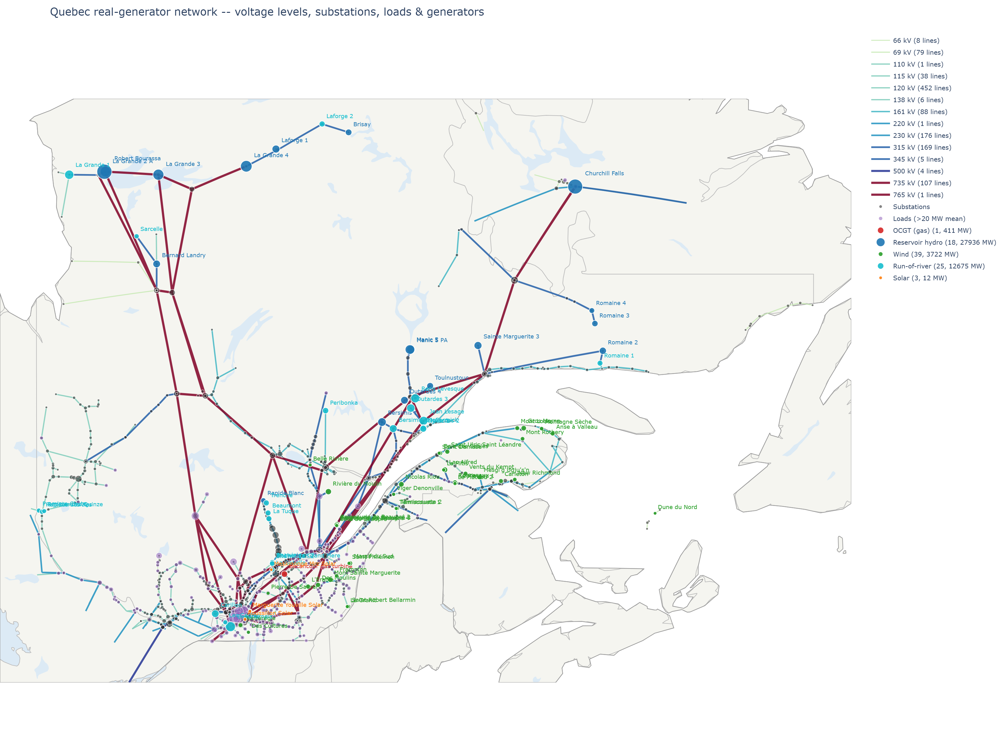
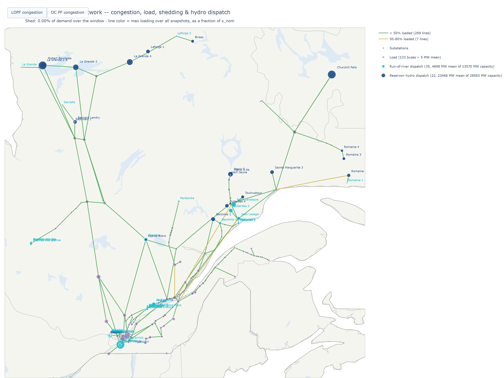

# Network versions

Three networks at different voltage resolution, each built for a different purpose. Current files
are in `network/networks_current/`; earlier versions are in `networks_current/_archive/`.

## 1. Unreduced (`elec_full.nc`)

PyPSA-Earth's OSM-derived topology with the raw-network data fixes applied (see the workflow in
[../README.md](../README.md)). Every voltage level from 60 to 765kV, 4,013 buses, 4,546 lines, 796
transformers, 47 DC links.

The topology covers all of Canada (roughly 1,400 buses are in Quebec), but its generators are
Quebec only: `attach_real_generators.py` replaced PyPSA-Earth's generators with Hydro-Québec's
station data. Demand here is PyPSA-Earth's synthetic demand for all of Canada (92.6 GW mean) and is
not calibrated. `visualize_real_network_map.py` maps it.

## 2. 315kV (`elec_reduced.nc` -> `elec_solved.nc`)

`reduce_voltage_network.py` keeps every bus at 315kV or above in Quebec's region and reassigns each
lower-voltage bus to its nearest kept bus by straight-line distance; no load, generator or storage
unit is dropped. `elec_reduced.nc` has 210 buses, 278 lines, 22 transformers and 6 links, with the
generation-capacity correction applied (see [GENERATORS.md](GENERATORS.md)).

`run_lopf_main_island.py` keeps the largest connected island and solves LOPF: 205 buses, 276 lines,
5 DC links, 22 transformers, 647 loads, 72 generators, 22 storage units. This is the main working
network. Mean demand 28,871 MW over the solved week, **0% load shed**.

The island extraction drops two small groups of buses cut off from the main grid in this
reduction, with 6 wind farms (438 MW) and 44 loads: bus 1315 (Baie-des-Chaleurs) and buses
329-3975 (Estrie). In reality they connect through lines below 315kV that the reduction removes.

AC power flow does not converge on this network (1/168) -- see [POWER_FLOW.md](POWER_FLOW.md).

## 3. 735kV backbone (`elec_735kv.nc`, `elec_735kv_shunt.nc`)

`reduce_to_735kv.py` keeps the 735/765kV buses and lines (765kV treated as 735kV) and reassigns
every other bus to its nearest backbone bus by shortest path over real line length. Loads on the
same bus are summed; generators and storage of the same carrier on the same bus are merged. The
LOPF dispatch is carried over as fixed `p_set`; this network is not re-optimized. Slack is set to
`114 ror`.

58 buses, 109 lines, 58 loads, 23 generators, 11 storage units, no links or transformers. Built for
AC power flow: small and meshed, so divergence can be diagnosed.

- `elec_735kv.nc`: circuit-count correction and 70% series compensation applied. AC PF 168/168,
  0.904-1.123 pu.
- `elec_735kv_shunt.nc`: the same plus 5 shunt capacitors and 11 shunt reactors. AC PF 168/168,
  0.966-1.059 pu.

See [POWER_FLOW.md](POWER_FLOW.md) for each step and the results.

Line parameters (r/x/b) on all 315/345kV and 735/765kV lines come from Hydro-Québec's
line-characteristics table (`hq_line_characteristics_by_voltage.csv`,
`apply_hq_line_characteristics.py`) -- see [DATA_SOURCES.md](DATA_SOURCES.md).
