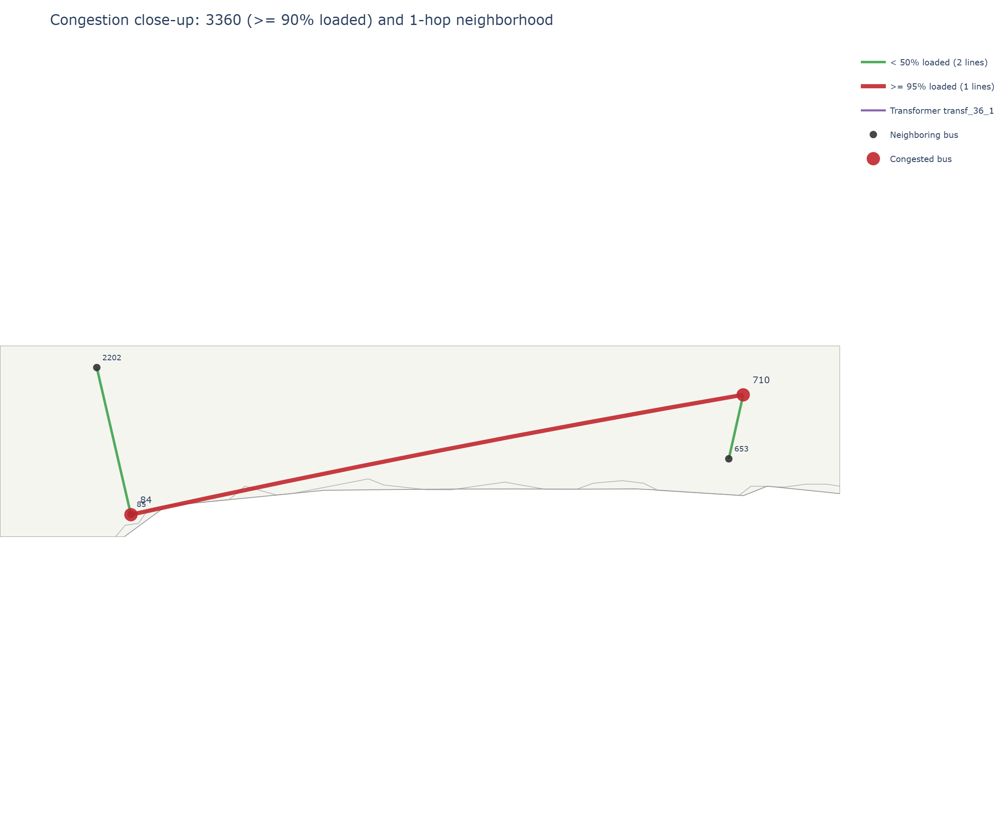
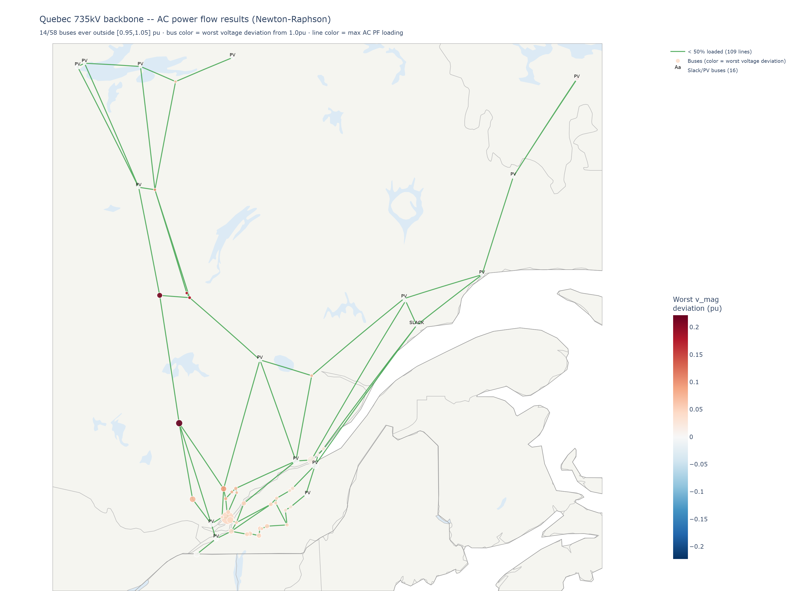

# Power flow results

## LOPF (linear optimal power flow) -- `elec_solved.nc`

Solved on the main 315kV working network's largest island (205 buses) over a one-week window
(2022-01-01 to 2022-01-07, 168 hourly snapshots).

- **0% load shed.** Every hour's demand is fully served from the modeled fleet.
- Mean demand ~30,200 MW, calibrated against real whole-January-2022 system demand
  (`historique-demande-electricite-quebec.csv`).
- Max line loading ~96% -- security margin (`s_max_pu`) is relaxed from PyPSA-Earth's default 0.7
  to 1.0; see [ASSUMPTIONS_AND_LIMITATIONS.md](ASSUMPTIONS_AND_LIMITATIONS.md) for why.

## DC power flow

Run via `run_pf.py --method lpf` as a linear sanity check against the LOPF dispatch. Has been
clean throughout this project on every network tried -- no convergence issues at any stage.

## AC power flow (full nonlinear Newton-Raphson) -- open, unresolved

**Neither reduced network fully converges under AC PF at current real demand.** Current state
(line reactance corrected against real Hydro-Quebec data -- see the note below the table):

| Network | Convergence at current demand | At reduced demand |
|---|---|---|
| 315kV (`elec_solved.nc`, 205 buses) | 0/168 | 0/168 at 62% -- no improvement |
| 735kV (`elec_735kv.nc`, 58 buses, 109 lines) | 85/168 | **168/168 at 62%** |

**Line reactance correction (2026-09-23):** every line's r/x/b previously came from PyPSA-Earth's
generic default type (`Al/St 560/50 4-bundle 750.0`, a German textbook value at 50Hz -- see
[DATA_SOURCES.md](DATA_SOURCES.md)), not from the Hypersim/HQ data already sitting in this
project's own CSVs, which had only ever been wired into the St Clair thermal (`s_nom`) calculation.
Fixed via `fix_line_reactance_hypersim.py` (all AC lines >= 220kV, log-log interpolated from the
Hypersim/EMTP table) and `apply_hq_line_characteristics.py` (315/345kV and 735/765kV lines
specifically, overridden with Hydro-Quebec's own exact real line-characteristics table -- more
authoritative than the interpolated Hypersim values for exactly the two tiers this project's
reduced networks keep). Net effect: 735kV line x_pu +19-20%, 315kV x_pu roughly -8% (HQ's real
315kV data has lower reactance than the interpolated Hypersim estimate). This **materially
tightened** AC PF convergence -- the demand level needed for full 735kV convergence dropped from
85% to 62%, and 100%-demand convergence changed from 50/168 to 85/168. This is a real change in
the model's difficulty, not a relabeling -- treat any AC PF finding from before this fix as
referring to the old, understated-reactance network.

### What's been ruled out on the 735kV network

Several fixes attemped but all failed to meaningfully improve convergence:

- 10x local reactive compensation at every bus: 1/71 (of the snapshots that fail at baseline)
- Strengthening any single stressed corridor, or the top 3/6 most-loaded corridors (2x capacity): 0/71
- Doubling capacity on **all 109 lines network-wide**: 0/71
- Modal (eigenvector) analysis consistently identifies the same critical bus cluster (132, 133,
  3554, 136, 1081, 195, 603, 1717 -- the 735/765kV bridge area) across every tested snapshot, but
  increasing loading capacity of the lines connected to the exact bus yielded no meaningful result: 0/71

Only a uniform reduction of real+reactive power at every bus simultaneously works; confirmed as
168/168 across the full network at 62% scale (this elimination testing itself was done before the
reactance correction above -- the qualitative finding, that no localized reinforcement helps, has
not been re-tested against the corrected network, only the demand-scale threshold has).

### The 315kV network fails differently

Unlike the 735kV network, reducing demand does **not** help the 315kV network at all (still 0/168
even at 62% demand, with far more extreme numerical blowup -- hundreds of lines "loaded" past
absurd percentages). This isn't a loadability-margin problem like the 735kV case; something
structurally different is going on, and it hasn't been diagnosed.

### MATPOWER cross-check

**Predates the line reactance correction above -- not yet re-run against the corrected network.**
The numbers below describe the old, understated-reactance 735kV network.

`export_to_matpower.py` exports a single snapshot (a static case format, not a time series) to an
independent solver. Tested at the easiest (lowest-loaded) snapshot for both the 85%-scaled and
real 100%-demand 735kV networks -- **both converged in MATPOWER**, confirming PyPSA's own result
independently at that hour. This is a relaxed test, not a stress test: the snapshot was
deliberately chosen as the easiest of the week, so it doesn't speak to the snapshots that fail.

| Metric | PyPSA (100%) | MATPOWER (100%) |
|---|---|---|
| Total load P/Q | 24,763.3 / 8,139.3 | 24,763.3 / 8,139.3 (exact match) |
| Total generation P | 25,837.6 | 25,914.0 |
| Voltage magnitude range | 0.995-1.115 pu | 0.927-1.082 pu |
| Slack P/Q | 3,586.1 / -594.8 | 4,361.6 / +504.7 (**sign flips**) |
| Line losses P | 1,074.3 MW | 1,150.7 MW |

Real power/load agree closely; reactive power and voltage magnitude diverge between solvers, more
so at 100% than at 85% demand -- consistent with the system's reactive-power solution becoming
less well-constrained as demand rises, in both solvers, not just PyPSA.

### Generic assumptions used only for AC PF

AC power flow needs reactive power data the LOPF/DC stages don't model. `run_pf.py` fills this in
with generic, documented assumptions at the point they're introduced -- see
[ASSUMPTIONS_AND_LIMITATIONS.md](ASSUMPTIONS_AND_LIMITATIONS.md) for the full list (load and
generator power factors, transformer X/R ratio, PV/PQ classification thresholds, and the current
demand-following reactive-compensation model).
