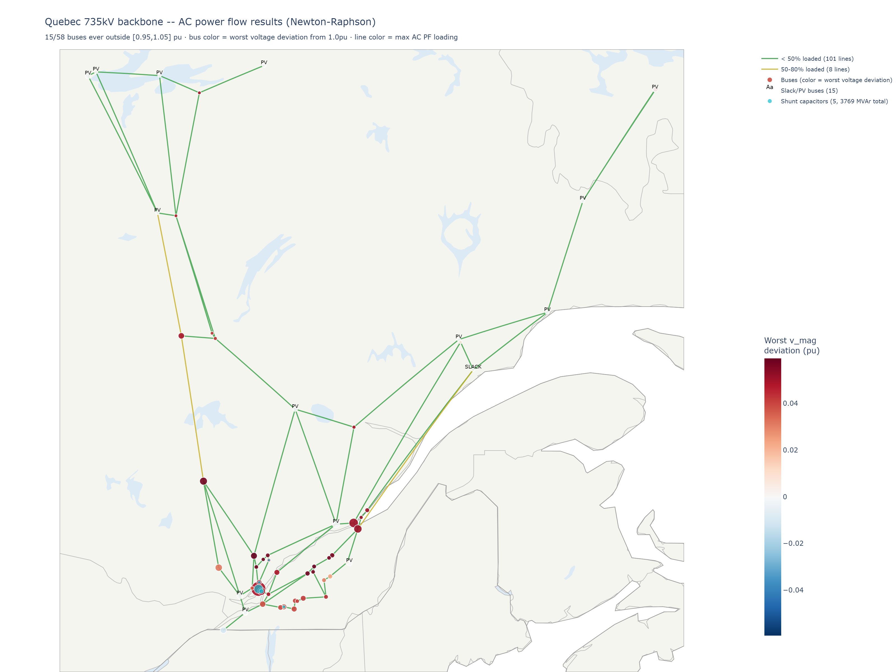

# Power flow results

One week, 2022-01-01 to 2022-01-07, 168 hourly snapshots. Mean demand 28,871 MW (minimum 22,027,
peak 34,959), calibrated to the real demand of that week.

## LOPF (linear optimal power flow) -- `elec_solved.nc`

Solved on the 315kV network's largest island (205 buses).

- **0% load shed.**
- Max line loading 71.9% (P against `s_nom`), 0 lines >= 90%.
- Dispatch by carrier: see [GENERATORS.md](GENERATORS.md).

LOPF enforces power balance, Kirchhoff's voltage law (flow split by reactance) and `|P| <= s_nom`.
It has no angle, voltage or reactive-power limit, so a feasible LOPF does not show that line
impedances are right: a corridor with no alternative path carries the same flow whatever its
reactance, only at a larger angle. AC power flow is the step that tests that.

## DC power flow

`run_pf.py --method lpf`, using the LOPF dispatch as fixed injections. Flows equal the LOPF flows.

| Network | Largest angle across a line | Lines > 30 deg | Max loading (P) |
|---|---|---|---|
| 315kV (`elec_solved.nc`) | 59.2 deg (line 3360, 710-84, 410 km) | 17 | 71.9% |
| 735kV (`elec_735kv.nc`, after the fixes below) | 25.2 deg (line 1469, 85-114, 260 km) | 0 | 61.6% |

Angles above about 30 deg mark corridors where AC power flow is likely to fail.

## AC power flow (Newton-Raphson)

### 735kV network

Each step of the pipeline, at full demand:

| Step | AC PF converged |
|---|---|
| `reduce_to_735kv.py` | 89/168 |
| + `correct_sending_end_circuits.py` (3 circuits on 5 corridors) | 110/168 |
| + `apply_series_compensation.py` (70% on 15 lines) | **168/168** |
| + `add_shunt_impedance.py` (5 capacitors, 11 reactors) | **168/168** |

Bus types: slack `114 ror` (Robert-Bourassa), 15 PV buses, the rest PQ. Every generator bus whose
mean load is below its local generation capacity is PV (`--pv-min-capacity 0
--pv-max-load-ratio 1`).

**Circuit count.** Five corridors leaving the major generating stations (114-1291, 114-148,
340-457, 66-457, 651-25) were modeled with 1-2 of their real 3 circuits. PyPSA stores a corridor as
one `Line` whose `x` is the combined reactance of its circuits (`x_per_km * length /
num_parallel`), so too few circuits means a reactance up to 3x too high. Maximum transfer is about
V^2/x, so these corridors could not deliver the James Bay output at peak hours: voltage collapsed
and no solution existed.

**Series compensation.** A series capacitor bank modeled as reduced line reactance, `x = x_per_km
* length / num_parallel * (1 - 0.7)`, on 15 lines: the ten 250-500 km lines feeding buses 308, 1291
and 312 (points of voltage collapse, found by continuation power flow) and the five lines with the
highest angles (162, 156, 1938, 1049, 1448, found by a DC PF angle check). Both fixes are needed:

| Series compensation | Converged (circuit counts corrected) |
|---|---|
| 0% | 110/168 |
| 50% | 168/168 |
| 70% (used) | 168/168 |

**Shunt reactors and capacitors.** PyPSA `ShuntImpedance` with a fixed susceptance `b`, `Q = V^2 * b`:
`b < 0` is a reactor at overvoltage buses, `b > 0` a capacitor at undervoltage buses. Sizing
(`add_shunt_impedance.py`):

1. Run AC PF and list every bus outside 0.95-1.05 pu at any hour.
2. Add a zero-P PV generator at all of them at once, held at the band edge it violates (1.05 or
   0.95 pu), and run AC PF. Its Q at each hour is the support needed to just reach the band.
   Probing together accounts for neighbouring devices helping each other.
3. Skip buses outside the band in both directions (a fixed device corrects only one) and buses
   whose probe never needs the device's direction.
4. Size each device at a fraction of its worst-hour Q, `b = scale * Q_worst / V_nom^2`: reactors
   100%, capacitors 70%. A fixed `b` sized for the worst hour is oversized at every other hour. The
   script also sweeps both scales from 0.3 to 1.0 and prints the result; the pair with the fewest
   buses out of band is reactors 100% / capacitors 40% (`--grid-best`).

Result: 5 capacitors (+3,769 MVAr) and 11 reactors (-6,106 MVAr).

### Results by reactive-support case

From `summarize_735kv_acpf.py` (`networks_current/summary_735kv_acpf.csv`). Circuit counts
corrected in all three. Values cover converged snapshots only.

| | No reactive support | Series compensation | Series compensation + shunts |
|---|---|---|---|
| Converged | 110/168 | 168/168 | 168/168 |
| Voltage range | 0.791-1.152 pu | 0.904-1.123 pu | 0.966-1.059 pu |
| **Undervoltage (< 0.95 pu)** | | | |
| Buses | 23 | 14 | 0 |
| Hours affected | 68 | 101 | 0 |
| Worst hours of day | 13-15h | 07-08h, 16-18h peaks | - |
| Demand when it occurs | 26.7-32.4 GW | 28.3-35.0 GW | - |
| **Overvoltage (> 1.05 pu)** | | | |
| Buses | 17 | 14 | 15 |
| Hours affected | 110 | 168 | 16 |
| Worst hours of day | 00-03h | 00-03h | 00-03h |
| Demand when it occurs | 22.0-32.4 GW | 22.0-35.0 GW | 22.0-29.1 GW |
| **Line stress** | | | |
| Largest line angle (lines > 30 deg) | 50.2 deg (13) | 25.0 deg (0) | 25.1 deg (0) |
| Max loading P / S | 38.9% / 39.0% | 60.6% / 60.6% | 60.5% / 60.6% |

The no-support column excludes its 58 failed hours, which are the high-demand ones (29.2-35.0 GW),
so it understates stress.

- **Series compensation** lowers angles and lets every hour converge. It does not add or absorb
  reactive power at buses, so voltage stays outside the band at both ends.
- **Overvoltage** comes from line charging. Below its surge impedance loading (about 2,080 MW per
  735kV circuit) a line generates more reactive power than it consumes, and buses far from
  voltage-controlling generators rise. Series compensation lowers the I^2*x the line consumes, so
  it does not help here; shunt reactors do.
- **With shunts**, undervoltage is cleared and overvoltage is limited to 16 overnight hours at the
  lowest demand. A fixed `b` cannot follow demand; switched shunts or SVCs would be needed to clear
  the rest.
- **Loading** is low on most lines because `s_nom` is St Clair x 3 (see
  [ASSUMPTIONS_AND_LIMITATIONS.md](ASSUMPTIONS_AND_LIMITATIONS.md)). The stressed lines are the long
  compensated corridors; compensation draws flow onto them.

### 315kV network

1/168 converged. The 315kV network does not have the circuit-count correction or series
compensation; they are applied only after reduction to 735kV. Its long 735kV corridors therefore
still have one circuit and full reactance (17 lines above 30 deg in DC PF). The divergence also
localizes to a radial spur of 315kV buses (240, 1548, 1762, 1772, 2207, 3719, 1693, 3836, 2812).
Applying the same corrections to the 315kV network, and checking its topology from
`reduce_voltage_network.py`, is open work.
